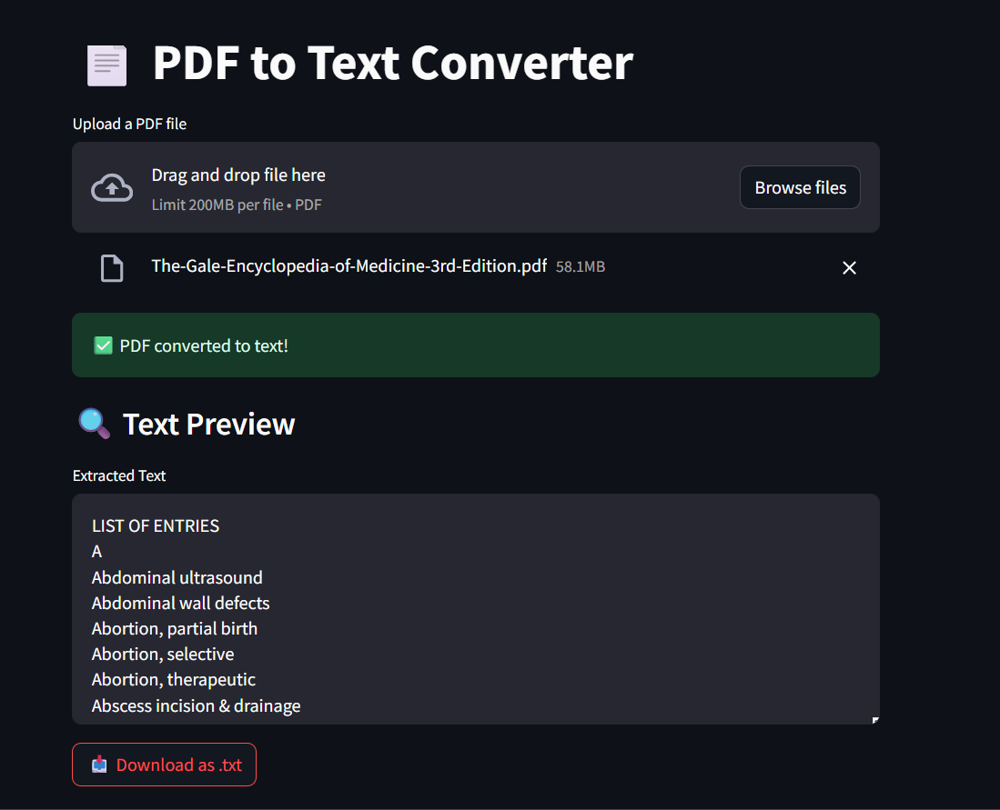

## 📄 PDF to Text Converter

Welcome to the **PDF to Text Converter** built with Python and Streamlit!
Upload any PDF file, extract clean text in seconds, and download it as a `.txt` file — all through a beautiful and easy-to-use web interface.


### 🚀 Live Demo

> ⚡ [Deployed on Streamlit Cloud](https://rishabh9559-pdf-to-text-pdf-to-text-ldeoke.streamlit.app)


### 👨‍💻 Developed by: Rishabh Kushwaha


## 🔧 Features

* 📤 Upload PDF files (single file)
* ⚙️ Real-time PDF text extraction using **PyMuPDF**
* ⏳ Loader animation while processing
* 📥 One-click `.txt` file download
* 💡 Clean and responsive UI with Streamlit


## 📁 Project Structure

```
pdf-to-text/
├── pdf_to_text.py            # 🧠 Main Streamlit app
├── requirements.txt          # 📦 Project dependencies
├── README.md                 # 📘 You're reading it!
```


## 💻 Run Locally

### 1. Clone the repository

```bash
git clone https://github.com/your-username/pdf-to-text.git
cd pdf-to-text
```

### 2. Create a virtual environment (recommended)

```bash
python -m venv venv
source venv/bin/activate  # On Windows: venv\Scripts\activate
```

### 3. Install dependencies

```bash
pip install -r requirements.txt
```

### 4. Run the Streamlit app

```bash
streamlit run pdf_to_text.py
```

Open your browser at 👉 `http://localhost:8501`


## 📝 Requirements

`requirements.txt`:

```
streamlit
PyMuPDF
```


## 📸 Screenshot




## 🙌 Support

If you like the project, consider giving it a ⭐ on GitHub!
For feedback or questions, feel free to reach out.

